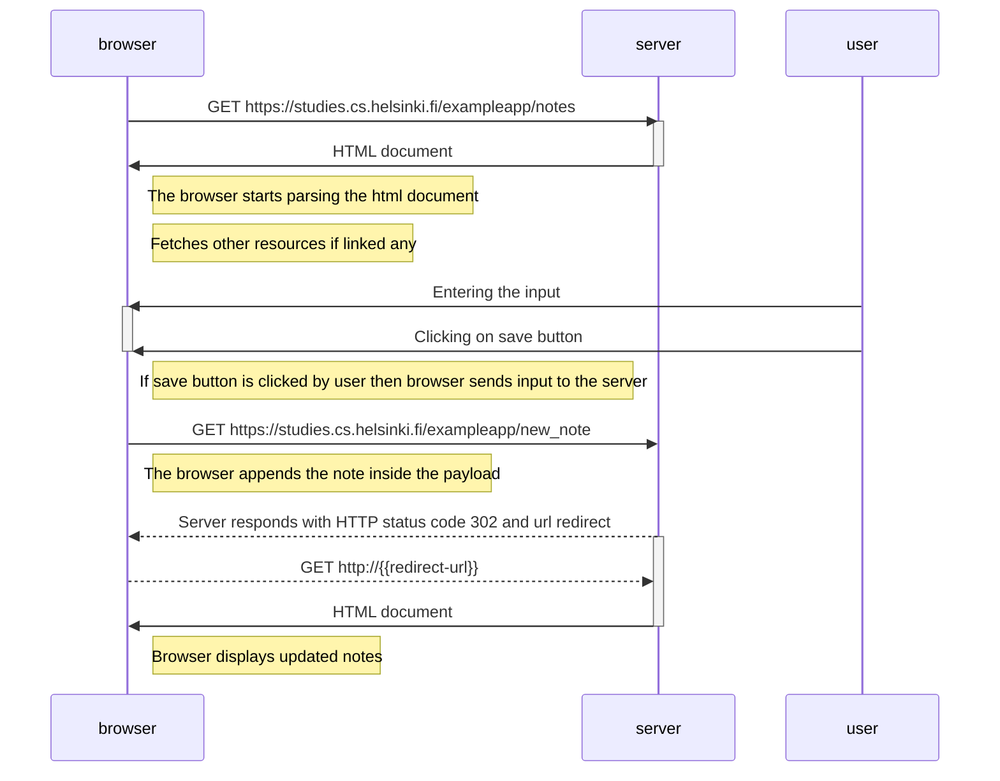

## Part 0.4 Answer

 

```mermaid
sequenceDiagram
    participant browser
    participant server
    participant user
    
    browser->>server: GET https://studies.cs.helsinki.fi/exampleapp/notes
    activate server
    server->>browser: HTML document
    deactivate server
    
    note right of browser: The browser starts parsing the html document
    note right of browser: Fetches other resources if linked any
    
    user->>browser: Entering the input
    activate browser
    user->>browser: Clicking on save button
    deactivate browser
    
    Note right of browser: If save button is clicked by user then browser sends input to the server

    browser->>server: GET https://studies.cs.helsinki.fi/exampleapp/new_note
    
    Note right of browser: The browser appends the note inside the payload

    server-->>browser: Server responds with HTTP status code 302 and url redirect
    activate server
    browser-->>server: GET http://{{redirect-url}}
    server->>browser: HTML document
    deactivate server

    Note right of browser: Browser displays updated notes

```
