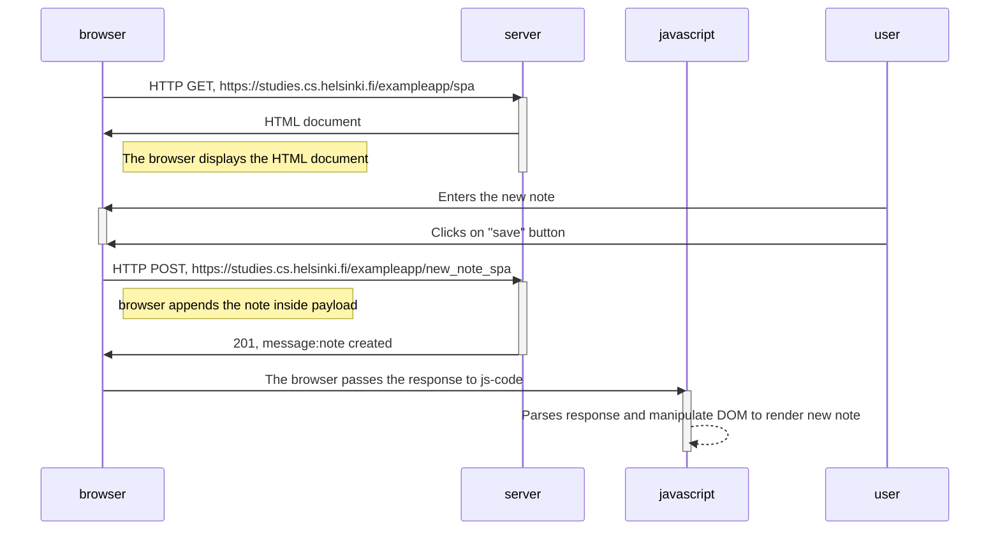

## Part 0.6 Answer

 

```mermaid
sequenceDiagram
    participant browser
    participant server
    participant javascript
    participant user

    browser->>server: HTTP GET, https://studies.cs.helsinki.fi/exampleapp/spa
    activate server
    server->>browser: HTML document
    note right of browser: The browser displays the HTML document
    deactivate server

    user->>browser: Enters the new note
    activate browser
    user->>browser: Clicks on "save" button
    deactivate browser

    browser->>server: HTTP POST, https://studies.cs.helsinki.fi/exampleapp/new_note_spa
    activate server
    note right of browser: browser appends the note inside payload
    server->>browser: 201, message:note created
    deactivate server

    browser->>javascript: The browser passes the response to js-code
    activate javascript
    javascript-->>javascript: Parses response and manipulate DOM to render new note
    deactivate javascript


```