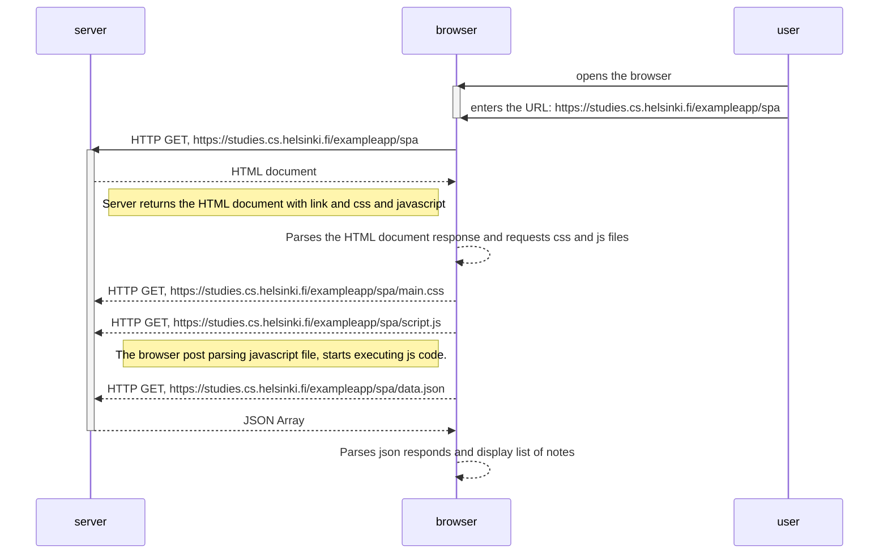

## part 0.5 Answer

 

```mermaid
sequenceDiagram
    participant server
    participant browser
    participant user

    user->>browser: opens the browser
    activate browser
    user->>browser: enters the URL: https://studies.cs.helsinki.fi/exampleapp/spa
    deactivate browser

    browser->>server: HTTP GET, https://studies.cs.helsinki.fi/exampleapp/spa
    activate server
    server-->>browser: HTML document

    note right of server: Server returns the HTML document with link and css and javascript
    
    browser-->>browser: Parses the HTML document response and requests css and js files

    browser-->>server: HTTP GET, https://studies.cs.helsinki.fi/exampleapp/spa/main.css
    browser-->>server: HTTP GET, https://studies.cs.helsinki.fi/exampleapp/spa/script.js

    note left of browser: The browser post parsing javascript file, starts executing js code.

    browser-->>server: HTTP GET, https://studies.cs.helsinki.fi/exampleapp/spa/data.json
    server-->>browser: JSON Array
    deactivate server
    browser-->>browser: Parses json responds and display list of notes    
    
```

